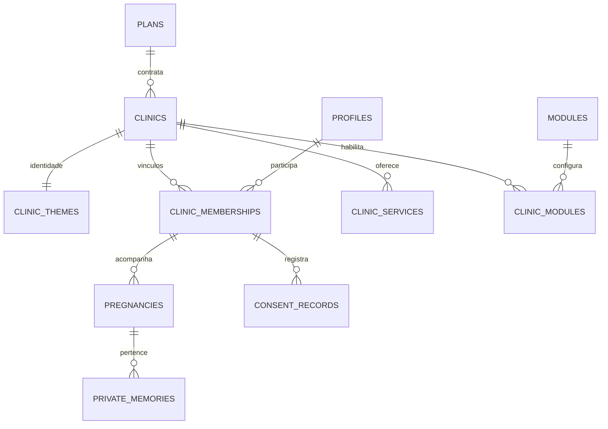

# Arquitetura da Etapa 1

Autoridade: `01_PROMPT_MESTRE_V1.md`; decisões obrigatórias: `03_REGRAS_FIXAS.md`. As cinco fontes foram lidas antes de implementar. Não foi usada uma instalação por cliente nem um banco alternativo em produção.

## Camadas

Next.js App Router / TypeScript / Tailwind → Server Components e Server Actions → Supabase SSR → Supabase Auth + PostgreSQL RLS + Storage privado. O navegador não decide o papel nem o tenant autorizado. As ações revalidam o usuário e o vínculo no servidor. A API do banco também aplica as políticas, mesmo se chamada diretamente.

A arquitetura SSR segue as interfaces documentadas por [Supabase](https://supabase.com/docs/guides/auth/server-side/creating-a-client) e os cookies assíncronos de [Next.js](https://nextjs.org/docs/app/api-reference/functions/cookies). A verificação de identidade usa `getUser()`; não usa o usuário retornado por `getSession()` como fonte de autorização. A origem de callbacks vem de `APP_URL`, nunca de um Host encaminhado arbitrariamente.

## Relações

`profiles.user_id` referencia `auth.users.id`. `superadmins` vincula apenas usuários provisionados por uma operação administrativa confiável. `clinic_domains` reserva domínios verificados para roteamento futuro; a Etapa 1 usa `/{slug}`. `audit_logs` guarda ação, entidade e autor, sem copiar dados de gestação ou memórias.

`pregnancies(clinic_id,user_id)` referencia o vínculo da mesma pessoa na mesma clínica. `private_memories(pregnancy_id,clinic_id,user_id)` referencia a gestação por chave composta, impedindo combinar gestação de outra pessoa ou clínica. Há índice parcial de uma gestação ativa por pessoa/clínica. Datas DUM são convertidas em DPP com 280 dias para a base operacional; não há diagnóstico nem conteúdo clínico gerado.

## Matriz efetiva de autorização

| Recurso | Gestante | Equipe | Admin da clínica | Superadmin |
| --- | --- | --- | --- | --- |
| Identidade pública de clínica ativa | Projeção pública por slug | Igual | Igual | Igual |
| Perfil pessoal | Próprio | Próprio | Próprio | Próprio |
| Dados operacionais da gestação | Próprios | Sua clínica | Sua clínica | Sem acesso direto nesta etapa |
| Memórias e arquivos privados | Próprios | Nenhum | Nenhum | Nenhum |
| Consentimentos | Próprios | Nenhum | Nenhum | Nenhum |
| Tema | Leitura da própria clínica | Leitura | Alteração da própria clínica | Administração por RLS |
| Papéis de equipe | Nenhum | Nenhum | RPC validada na própria clínica | RPC validada |
| Planos, módulos, status | Nenhum | Nenhum | Sem alteração comercial | Administração por RLS |
| Auditoria | Nenhum | Nenhum | Sua clínica | Plataforma |

As telas completas dos painéis ainda não existem. A matriz descreve as permissões do banco e os acessos implementados, não funcionalidades futuras concluídas.

## Cadastro e sessão

O cadastro envia nome, e-mail, senha, DPP ou DUM e três aceites. A confirmação sensível explicita a finalidade. O trigger do banco valida clínica ativa, datas, versões dos aceites e cria perfil, vínculo `patient`, gestação e consentimentos em uma transação. Metadados como `role=clinic_admin` são ignorados. Um erro desfaz toda a transação.

A trava de cadastro no banco é independente da UI. As sessões são validadas pelo Supabase Auth. Papéis são lidos do banco em cada acesso; a revogação não espera expirar um papel gravado no JWT. Rotas autenticadas são dinâmicas, com resposta privada e sem cache compartilhado.

## Temas

Doze tokens obrigatórios: `primary`, `primarySoft`, `secondary`, `accent`, `background`, `surface`, `text`, `muted`, `border`, `onPrimary`, `danger`, `focus`. Valores são aceitos apenas como hexadecimal de seis dígitos. A validação existe no banco e em TypeScript. Cores literais estão apenas nas definições de tema e seeds; componentes consomem variáveis CSS.

A identidade é carregada antes de renderizar o conteúdo. Não há cache global de clínica. O editor permite a administrador alterar cores, logo e contatos, com prévia local e persistência explícita. A interface verifica contraste dos principais pares de texto e fundo. A logo Jornada da Gestante não foi redesenhada; aguardamos o ativo oficial.

Cartas, PDFs e materiais futuramente devem consumir o mesmo contrato de tokens. Nenhum gerador desses materiais foi criado nesta etapa.

## Storage e exclusão

Bucket `clinic-branding`, público, limite de 2 MiB, PNG/JPEG/WebP. Escrita e exclusão por administrador da clínica correspondente ou superadmin. Caminho `clinic_id/arquivo`. Logos são ativos públicos, não dados pessoais de gestantes.

Bucket `avatars`, privado, limite de 2 MiB, PNG/JPEG/WebP. Caminho `user_id/arquivo`, vinculado a `profiles.avatar_path`, com acesso restrito ao proprietário. A tela usa URL assinada curta. Uploads preservam os bytes, validam tamanho, MIME e assinatura do formato, sem chave de serviço.

Bucket `private-memories`, privado, limite de 10 MiB, formatos JPEG/PNG/WebP/PDF. Políticas usam o caminho `clinic_id/user_id/pregnancy_id/arquivo`, validam propriedade da gestação e negam diretórios adicionais. O nome não é usado isoladamente como prova de autorização.

A exclusão solicita senha novamente. O servidor rejeita contas com qualquer vínculo administrativo. A chave de serviço fica em módulo `server-only` e só executa consultas restritas ao usuário reautenticado. Remove arquivos antes da conta Auth, respeitando a restrição de propriedade do Supabase Storage. Excluir `auth.users` apaga, por cascata, perfil, vínculos, gestação, memórias e consentimentos. Auditoria administrativa possui política de retenção a definir na revisão de privacidade.

Storage e Auth são serviços diferentes, portanto a exclusão não é uma transação distribuída: falha intermediária retorna erro e permite repetição; arquivos já removidos não são restaurados. Esse fluxo precisa de teste real com Supabase antes de liberação. Exportação atual inclui registros JSON e caminhos de arquivos, não os binários das fotos; uma exportação completa de mídia e os procedimentos de retirada específica de consentimento precisam ser validados antes de pacientes reais.

## Escopo futuro preservado

Não foram criados diagnósticos, agenda médica, WhatsApp automático, médicos ou serviços inventados para clínicas reais. Serviços de demonstração seguem o Prompt-Mestre. Conteúdo médico central e sua edição só serão implementados na etapa correspondente, sob controle da Jatobá e com revisão profissional.
